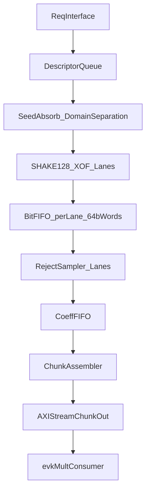

## OTF eval-key `a` keygen RTL sample (SystemVerilog)

샘플 목적:
- on-the-fly eval-key `a` 생성 엔진을 하드웨어로 설계한다면 **어떤 블록들로 나눠지고**, **어떤 backpressure가 생기며**, **어떻게 chunk 스트리밍으로 소비자(evk mult)와 맞물릴지**를 보여주는 **아키텍처 예시 RTL**.
- 타이밍 최적화/면적 최적화/보안 수준은 목표가 아님(교육/스케치 용도).

핵심 동작:
- SHAKE128 XOF로부터 64-bit word 스트림을 얻음
- limb modulus `q`에 대해 reject sampling으로 `0 <= coeff < q` 균일 샘플 생성
- 결과를 “NTT-domain `a`”로 취급하고 downstream에서 추가 NTT 없이 소비
- `chunk_size`개의 coeff를 묶어 AXI-Stream 형태로 점진적 emit (`tvalid/tready`)

---

## 블록 다이어그램

---

## 인터페이스(샘플)

### Request interface
- `req_valid/req_ready`
- `req` (packed struct)
  - `master_seed[255:0]`
  - `key_id, decomp_id, limb_id, poly_id` (domain separation용)
  - `q` (limb modulus, 64b)
  - `threshold_T` (optional, 64b): `T = floor(2^64/q)*q`를 SW가 미리 계산해 주면 RTL에서 나눗셈 제거 가능
  - `num_coeffs` (생성할 계수 개수)

### Output interface (AXI-Stream 스타일)
- `m_axis_tvalid`, `m_axis_tready`
- `m_axis_tdata`: `CHUNK_SIZE * COEFF_W` 비트 묶음 (기본 COEFF_W=64, 샘플은 u64로 coeff 전달)
- `m_axis_tlast`: 해당 req의 마지막 chunk 표시

---

## 파라미터/knobs(샘플)

`otf_keygen_pkg.sv`에 정의:
- `NUM_SHAKE_LANES`, `NUM_SAMPLER_LANES`
- `BITFIFO_DEPTH_WORDS` (lane당 64-bit word FIFO 깊이)
- `COEFF_FIFO_DEPTH`
- `CHUNK_SIZE`
- `COEFF_W` (기본 64)

---

## 모듈 구성(파일)

- `otf_keygen_pkg.sv`: 타입/파라미터/헬퍼
- `keccak_f1600.sv`: 순차 24라운드 Keccak-f[1600] permutation (비최적)
- `shake128_xof.sv`: absorb+pad+finalize+squeeze(168B rate)로 64-bit word stream 생성
- `sync_fifo.sv`: 단순 1clk FIFO (word/coeff 용)
- `reject_sampler_lane.sv`: `x<T` 비교 + `x%q` 산출 + coeff FIFO push
- `chunk_assembler.sv`: coeff FIFO에서 `CHUNK_SIZE`개 모아 AXI-Stream `tdata` 구성
- `otf_evalkey_a_top.sv`: descriptor queue + lane 매핑 + 전체 연결
- `tb_otf_evalkey_a_top.sv`: 간단 TB(샘플)

---

## 구현/설계 메모

- **T 계산**: reject sampling의 `T=floor(2^64/q)*q`는 RTL에서 128-bit 나눗셈이 필요할 수 있음. 샘플은 두 가지 모드 제공:
  - `req.threshold_T`를 사용(권장): SW가 계산해서 제공 → RTL은 `x<T`만 수행
  - `threshold_T=0`이면 RTL에서 느린 나눗셈 기반으로 계산(샘플/가독성용)
- **Modulo `%`**: `x % q`는 나눗셈이 필요. 샘플은 간단히 `%`를 사용(합성 가능하나 느림). 실설계는 Barrett/Montgomery로 교체.
- **Domain separation**: `master_seed` + ids(`key_id/decomp_id/limb_id/poly_id/lane_id`)를 바이트 직렬화해 SHAKE absorb.
- **Backpressure**: AXI-Stream `tready=0`이면 coeff FIFO가 차고, sampler가 stall, bit FIFO가 차고, SHAKE lane이 stall.

